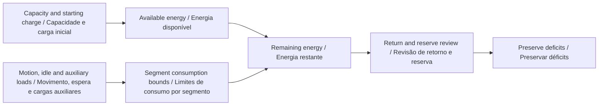
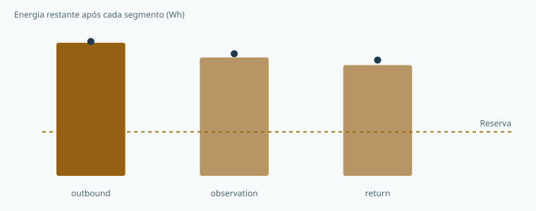

# Go2 PRO Energy Planner

**Make mission energy assumptions and return reserves visible.**  
**Torne visíveis as hipóteses de energia e a reserva para retorno.**

[](https://github.com/galafis/go2-pro-energy-planner/actions/workflows/ci.yml) · **v0.1.0** · **28 browser tests / testes do navegador** · **MIT**

[English](#english) · [Português](#portugues) · [Live workbench · Demonstração](https://galafis.github.io/go2-pro-energy-planner/) · [Examples · Exemplos](#examples)

<!-- domain-workflow:start -->

## Domain workflow · Fluxo do domínio



<!-- domain-workflow:end -->

<a id="english"></a>

## English

A mission-energy workbench for explicit capacity, power, dwell-time and reserve assumptions. It compares nominal consumption with lower and upper deterministic scenarios and includes an explicit return segment.

This is a software workbench in a research portfolio centered on the Unitree Go2 PRO. The current release runs independently of physical hardware.

### What works today

- Separate motion, stationary and auxiliary power accounting.
- Capacity derating and state-of-charge inputs expressed independently.
- An explicit return segment and reserve expressed as a fraction of effective capacity.
- Correlated power-uncertainty bounds, remaining-energy charts and deficit findings.
- A reusable reserve-sensitivity function with no random sampling.


### Run it locally

Use **Node.js 22 or newer**. There are no third-party runtime packages to install.

```sh
git clone https://github.com/galafis/go2-pro-energy-planner.git
cd go2-pro-energy-planner
npm test
npm start
```

Open **http://127.0.0.1:4173**. The browser includes an English/Portuguese switch. Choose an example, adjust the primary assumption, and select **Update**. Expand **Edit all scenario fields** for the complete JSON editor. Invalid imports leave the last valid result visible with an explicit error message. Export both the scenario and report to preserve the experiment.

For headless use:

```sh
node scripts/analyze.mjs examples/nominal.json report.json
npm run examples
npm run test:coverage
```

The command-line exit codes are **0** for completed analysis or review notes, **2** for a valid scenario that needs review, and **1** for invalid input or invocation. A review-required result is still written to the requested report file.

### An experiment you can reproduce

The nominal scenario uses a hypothetical 200 Wh capacity with a 0.9 factor, 80% initial charge and 25% reserve: 144 Wh available and 45 Wh reserved. Two 60 m traversals plus a ten-minute observation consume 25.5 Wh nominally. At 20% power uncertainty, upper consumption is 30.6 Wh and margin after reserve is 68.4 Wh.

### How the result is calculated

- Motion time equals distance divided by supplied speed. Dwell time is added separately.
- Integrate constant segment power over time and convert watt-seconds to watt-hours by dividing by 3,600. Auxiliary power applies during motion and dwell.
- Effective capacity equals capacityWh multiplied by capacityFactor. Both available energy and the requested reserve are fractions of effective capacity, not fractions of one another.

```text
E(Wh) = ((motionW + auxW) × distanceM / speedMps + (idleW + auxW) × dwellS) / 3600
```

The [architecture guide](docs/ARCHITECTURE.md) explains every rule and boundary case. The [data contract](docs/DATA_CONTRACT.md) documents fields, units, limits and the report envelope. [Research scope](docs/RESEARCH_SCOPE.md) separates implemented behavior from future platform work.

### What the result does not establish

The supplied power and capacity values are illustrative, not measured Go2 PRO specifications. Constant power does not model gait transitions, terrain, acceleration, battery temperature, aging or voltage sag. The return estimate is supplied explicitly and does not calculate a return route. A feasible result is conditional on these assumptions.

### Where this fits

Measure repeated operator-supervised trials with a documented configuration, environment and load. Record usable capacity and segment power using supported measurement methods. Replace illustrative values, compare predicted and measured Wh, and select reserves through a separately reviewed operating protocol.

Related public project: [rescue-scenario-lab](https://github.com/galafis/rescue-scenario-lab). Each repository is independently runnable; a link does not imply a live integration. See [integration notes](docs/INTEGRATION.md) for the exact supported exchange, where present.

[Back to language navigation](#english)

---

<a id="portugues"></a>

## Português

Uma bancada de energia de missões com hipóteses explícitas de capacidade, potência, permanência e reserva. Compara consumo nominal com cenários determinísticos inferior e superior e inclui um segmento explícito de retorno.

Esta é uma bancada de software de um portfólio de pesquisa centrado no Unitree Go2 PRO. A versão atual funciona independentemente de hardware físico.

### O que já funciona

- Contabilização separada de potência em movimento, em repouso e auxiliar.
- Redução da capacidade e estado de carga informados independentemente.
- Segmento de retorno explícito e reserva como fração da capacidade efetiva.
- Limites de incerteza correlacionada da potência, gráficos de energia restante e indicação de déficits.
- Função reutilizável de sensibilidade da reserva, sem amostragem aleatória.



### Executar localmente

Use **Node.js 22 ou mais recente**. Não há pacotes externos de execução para instalar.

```sh
git clone https://github.com/galafis/go2-pro-energy-planner.git
cd go2-pro-energy-planner
npm test
npm start
```

Abra **http://127.0.0.1:4173**. O navegador oferece alternância entre português e inglês. Escolha um exemplo, ajuste a hipótese principal e selecione **Atualizar**. Expanda **Editar todos os campos do cenário** para acessar o editor JSON completo. Importações inválidas mantêm o último resultado válido visível com mensagem explícita de erro. Exporte o cenário e o relatório para preservar o experimento.

Para usar sem interface gráfica:

```sh
node scripts/analyze.mjs examples/nominal.json report.json
npm run examples
npm run test:coverage
```

Os códigos de saída são **0** para análise concluída ou com notas, **2** para cenário válido que exige revisão e **1** para entrada ou chamada inválida. Resultados que exigem revisão também são gravados no arquivo de relatório solicitado.

### Um experimento reproduzível

O cenário nominal usa capacidade hipotética de 200 Wh com fator 0,9, carga inicial de 80% e reserva de 25%: 144 Wh disponíveis e 45 Wh reservados. Dois percursos de 60 m e dez minutos de observação consomem nominalmente 25,5 Wh. Com incerteza de potência de 20%, o consumo superior é 30,6 Wh e a margem após a reserva é 68,4 Wh.

### Como o resultado é calculado

- O tempo de movimento é a distância dividida pela velocidade informada. O tempo de permanência é somado separadamente.
- Integre a potência constante de cada segmento no tempo e converta watt-segundos em watt-hora dividindo por 3.600. A potência auxiliar incide no movimento e na permanência.
- A capacidade efetiva é capacityWh multiplicada por capacityFactor. Energia disponível e reserva solicitada são frações da capacidade efetiva, não uma da outra.

```text
E(Wh) = ((motionW + auxW) × distanceM / speedMps + (idleW + auxW) × dwellS) / 3600
```

O [guia de arquitetura](docs/ARCHITECTURE.md) explica todas as regras e os casos limite. O [contrato de dados](docs/DATA_CONTRACT.md) documenta campos, unidades, limites e o formato do relatório. O [escopo de pesquisa](docs/RESEARCH_SCOPE.md) separa funcionalidades implementadas de futuras etapas com a plataforma.

### O que o resultado não comprova

Os valores de potência e capacidade são ilustrativos, não especificações medidas do Go2 PRO. Potência constante não modela mudanças de marcha, terreno, aceleração, temperatura, envelhecimento ou queda de tensão da bateria. A estimativa de retorno é informada explicitamente e não calcula uma rota de retorno. Um resultado viável depende dessas hipóteses.

### Como este projeto se conecta ao portfólio

Meça ensaios repetidos e supervisionados por operador, com configuração, ambiente e carga documentados. Registre capacidade utilizável e potência por segmento com métodos de medição compatíveis. Substitua os valores ilustrativos, compare Wh previstos e medidos e selecione reservas por meio de protocolo operacional revisado separadamente.

Projeto público relacionado: [rescue-scenario-lab](https://github.com/galafis/rescue-scenario-lab). Cada repositório funciona independentemente; um link não implica integração em tempo real. Consulte as [notas de integração](docs/INTEGRATION.md) para conhecer as trocas efetivamente suportadas, quando existentes.

---

<a id="examples"></a>

## Reproducible examples · Exemplos reproduzíveis

| Example · Exemplo                            | Result · Resultado | Reproduce · Reproduzir                                                                                        |
| -------------------------------------------- | ------------------ | ------------------------------------------------------------------------------------------------------------- |
| Corridor mission<br>Missão em corredor       | `complete`         | [Input · Entrada](examples/nominal.json) · [Report · Relatório](examples/nominal.report.json)                 |
| Insufficient reserve<br>Reserva insuficiente | `review-required`  | [Input · Entrada](examples/reserve-deficit.json) · [Report · Relatório](examples/reserve-deficit.report.json) |
| Auxiliary load<br>Carga auxiliar             | `complete`         | [Input · Entrada](examples/auxiliary-load.json) · [Report · Relatório](examples/auxiliary-load.report.json)   |

## Project guide · Guia do projeto

| Document · Documento                                          | Content · Conteúdo                                                                    |
| ------------------------------------------------------------- | ------------------------------------------------------------------------------------- |
| [Architecture · Arquitetura](docs/ARCHITECTURE.md)            | Domain rules, algorithms and boundaries · Regras, algoritmos e limites                |
| [Data contract · Contrato de dados](docs/DATA_CONTRACT.md)    | Fields, units and JSON format · Campos, unidades e formato JSON                       |
| [Schema](schemas/scenario.schema.json)                        | Structural JSON Schema · Esquema estrutural JSON                                      |
| [Validation · Validação](docs/VALIDATION.md)                  | Behavioral tests and review protocol · Testes de comportamento e protocolo de revisão |
| [Research scope · Escopo de pesquisa](docs/RESEARCH_SCOPE.md) | Platform relationship and next steps · Relação com a plataforma e próximas etapas     |
| [Integration · Integração](docs/INTEGRATION.md)               | Public artifact exchange · Troca de artefatos públicos                                |
| [Contributing · Contribuições](CONTRIBUTING.md)               | Development and review · Desenvolvimento e revisão                                    |
| [Security · Segurança](SECURITY.md)                           | Privacy and responsible reports · Privacidade e relatos responsáveis                  |
| [Changelog · Histórico](CHANGELOG.md)                         | Versioned changes · Alterações por versão                                             |

## Maintainer · Responsável

**Gabriel Demetrios Lafis** · Brazil / Brasil  
**[gabrieldemetrioslafis@usp.br](mailto:gabrieldemetrioslafis@usp.br)** · [GitHub](https://github.com/galafis)

Independent work; institutional contact does not imply institutional or vendor endorsement.  
Trabalho independente; o contato institucional não implica endosso de instituição ou fabricante.

[Worked examples with expected metrics · Exemplos comentados com métricas esperadas](docs/EXPERIMENTS.md)
