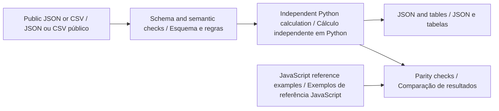

# Python offline guide · Guia Python offline

[English](#english) · [Português](#portugues) · [Project / Projeto](../README.md)

**Python companion v0.2.0 · Python 3.11+ · Python · JavaScript**



<a id="english"></a>

## English

Compute segment energy in Python and export a two-dimensional reserve/uncertainty sensitivity table. This supports choosing which assumptions should be measured first during a prospective Go2 PRO observation study.

### Install and run

From the repository root, create a virtual environment with `python -m venv .venv`. Activate it with `.venv\Scripts\Activate.ps1` in PowerShell or `source .venv/bin/activate` in a Unix shell. Use `python3` instead of `python` if required by your installation.

```sh
python -m pip install -r requirements-python.txt .
python -m go2_energy --help
python -m go2_energy analyze examples/nominal.json review-output/nominal.report.json
python -m go2_energy sweep examples/nominal.json review-output/sensitivity.csv
```

The first analysis creates `review-output/`. Use a new SQLite filename for a new archive, when applicable. Reimporting the same scenario identifier is rejected to preserve the previous record. Runtime calculations require Python and the declared schema-validation dependencies; Node is needed only for the browser application and cross-language tests.

### Method and worked example

Motion, dwell and auxiliary loads are accounted separately. Exactly one return segment is required at the end. Capacity derating and initial charge determine available energy; the reserve uses effective capacity. The uncertainty percentage is a fully correlated power bound applied to every segment, not a probability distribution.

```text
motionS = distanceM / speedMps
energyWh = ((motionW + auxW) * motionS + (idleW + auxW) * dwellS) / 3600
marginWh = availableWh - nominalWh * (1 + uncertaintyPct / 100) - reserveWh
```

The fictional nominal mission consumes 25.5 Wh. A 20% power bound gives 30.6 Wh; 144 Wh available minus that bound and a 45 Wh reserve leaves 68.4 Wh. The nine-row CSV compares three reserves with three uncertainty levels while preserving the same mission.

Browse the [committed inputs and outputs](../examples/python/README.md). CSV column order and names must match the example header exactly. Missing columns, extra columns, malformed numbers, duplicate identifiers and non-finite values are rejected where applicable. JSON rejects unknown fields and duplicate object keys. The public [scenario schema](../schemas/scenario.schema.json) defines units and field bounds; the domain module adds relationships that JSON Schema alone cannot express.

### Use as a library

```python
from pathlib import Path
from go2_energy import analyze
from go2_energy.contract import read_json

scenario = read_json(Path("examples/nominal.json"))
result = analyze(scenario)
print(result["scenarioId"])
```

See the [calculation module](../python/go2_energy/core.py) and [CLI](../python/go2_energy/__main__.py). The Python result is a documented offline summary, not the complete bilingual browser report envelope. Shared numerical fields and paths are independently compared; matching output is a software consistency check, not physical validation.

### Verify

Install Node.js 22+ for the independent JavaScript comparisons, then run:

```sh
python -m unittest discover -s python/tests -v
python scripts/check-python-examples.py
npm test
```

The Python suite covers the strict public contract, unchanged inputs, invalid-file handling, preservation of previous outputs, domain boundaries and every canonical example listed in `examples/index.json`. The example checker executes the documented workflows in a temporary directory and compares JSON/CSV artifacts. Use its `--write` option only after intentionally reviewing a changed result. CLI exit status is 0 for a completed calculation and 1 for invalid input or a failed integrity check. Inspect result flags for review conditions; this differs from the browser CLI's status-2 convention.

### Interpretation boundary

The sample capacity and loads are fictional inputs, not published Go2 battery specifications or measured endurance. Terrain, temperature, acceleration and battery aging require measurements beyond the supplied derating factor.

Go2 PRO remains the proposed observation platform. These tools contain no robot commands, and custom SDK support on standard PRO hardware is not assumed. See the [hardware study plan](RESEARCH_SCOPE.md).

<a id="portugues"></a>

## Português

Calcule a energia dos segmentos em Python e exporte uma tabela bidimensional de reserva e incerteza. Isso apoia a escolha das premissas que devem ser medidas primeiro em um futuro estudo de observação com o Go2 PRO.

### Instalação e execução

Na raiz do repositório, crie o ambiente com `python -m venv .venv`. Ative com `.venv\Scripts\Activate.ps1` no PowerShell ou `source .venv/bin/activate` em um shell Unix. Use `python3` se essa for a nomenclatura da instalação. Execute a sequência de comandos da seção inglesa: ela é a mesma nos dois idiomas. A primeira análise cria `review-output/`.

Instale com `python -m pip install -r requirements-python.txt .`. Os cálculos dependem de Python e das dependências declaradas para validação de esquema. Node.js 22+ é necessário somente para o aplicativo de navegador e para os testes entre linguagens. Quando houver SQLite, use um arquivo novo para um novo arquivo de análise; identificadores de cenário repetidos são rejeitados, preservando os registros existentes.

### Método e exemplo explicado

Movimento, permanência e cargas auxiliares são contabilizados separadamente. É exigido exatamente um segmento de retorno ao final. Redução de capacidade e carga inicial determinam a energia disponível; a reserva usa a capacidade efetiva. A incerteza é um limite de potência totalmente correlacionado aplicado a todos os segmentos, não uma distribuição de probabilidade.

A missão fictícia nominal consome 25,5 Wh. Um limite de potência de 20% produz 30,6 Wh; 144 Wh disponíveis menos esse limite e a reserva de 45 Wh deixam 68,4 Wh. O CSV de nove linhas compara três reservas com três níveis de incerteza, mantendo a mesma missão.

As fórmulas e os comandos acima usam nomes de campos estáveis, compartilhados pelos dois idiomas. Consulte as [entradas e saídas versionadas](../examples/python/README.md). Cabeçalhos CSV devem corresponder exatamente ao exemplo, incluindo a ordem. Colunas ausentes ou extras, números malformados, identificadores duplicados e valores não finitos são rejeitados quando aplicável. JSON rejeita campos desconhecidos e chaves repetidas. O [esquema público](../schemas/scenario.schema.json) define unidades e limites; o módulo de domínio valida relações adicionais.

### Biblioteca e validação

O exemplo Python da seção inglesa funciona diretamente. O [módulo de cálculo](../python/go2_energy/core.py) retorna um resumo offline documentado; ele não replica todo o envelope bilíngue do relatório de navegador. Os campos numéricos e caminhos compartilhados são comparados independentemente. Concordância é uma verificação de consistência do software, não validação física.

Execute `python -m unittest discover -s python/tests -v`, `python scripts/check-python-examples.py` e `npm test`. A suíte Python cobre o contrato, preservação de entradas, arquivos inválidos, manutenção da saída anterior, limites do domínio e todos os exemplos canônicos do índice. O verificador executa os fluxos em diretório temporário e compara os artefatos JSON/CSV. Use `--write` somente após revisar uma mudança intencional. O código de saída é 0 para cálculo concluído e 1 para entrada inválida ou falha de integridade. Consulte as sinalizações do resultado; a convenção difere do código 2 da interface de análise em JavaScript.

### Limites de interpretação

Capacidade e cargas de exemplo são entradas fictícias, não especificações da bateria do Go2 nem autonomia medida. Terreno, temperatura, aceleração e envelhecimento da bateria exigem medições além do fator de redução informado.

O Go2 PRO continua como plataforma proposta de observação. Estas ferramentas não contêm comandos de robô nem pressupõem suporte a SDK personalizado no PRO padrão. Consulte o [plano de estudo com hardware](RESEARCH_SCOPE.md).
